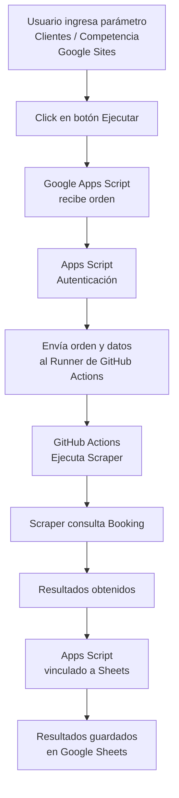
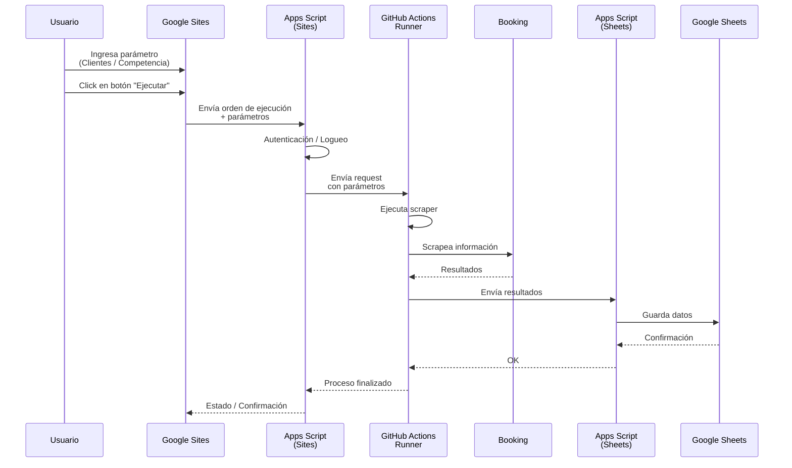

# Gesglos - Scraper
## Scrapper de hoteleria usado en booking.com

### para ejecutar el codigo correr estos comandos en docker:

    docker build -f dockerfile -t selenium-app . 
### &&
    docker run --shm-size=2gb selenium-app {{script_key}}

### por facilidad usa este comando largo:
     docker build -f dockerfile -t selenium-app . && docker run --shm-size=2gb selenium-app {{script_key}}

## Mapeo directo de parámetro → script_key
```JSON
{
    "clientes_diario"      : "Web_Scraping_Clientes.py",
    "clientes_prevision"   : "Web_Scraping_Clientes_Adhoc.py",
    "competencia_diario"   : "Web_Scraping_Competencia.py",
    "competencia_prevision": "Web_Scraping_Competencia_Adhoc.py",
    "seguimiento_diario"   : "Web_Scraping_Daily_Tracking.py",
    "personalizado"        : "Web_Scryping_Booking.py"
}
```
### para detener una imagen:
    sudo docker stop selenium-app

### para ver la salida de los logs:
    sudo docker logs -f selenium-app

### para borrar la imagen:
    sudo docker rm -f selenium-app

### para borrar todas las imagenes sin pedir confirmacion:
    sudo docker system prune -af

### para ver todas las imagenes:
    sudo docker images

### para ver todos los contenedores activos:
    sudo docker ps

### para ver todos los contenedores (prendidos-apagados):
    sudo docker ps -a

### Diagrama de flujo de proceso:

### diagrama de sequencias



