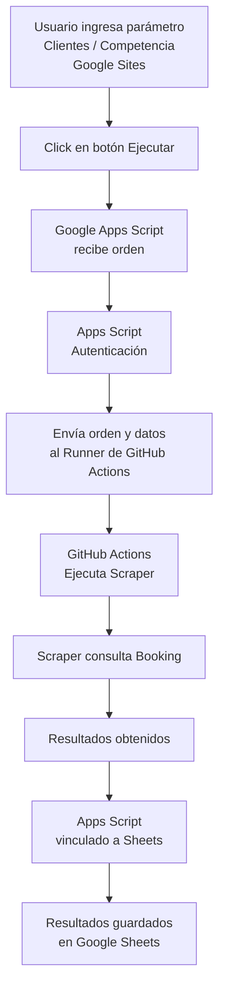
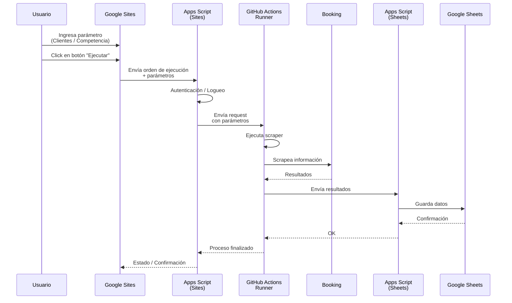

# Gesglos - Scraper
## Scrapper de hoteleria usado en booking.com

### para ejecutar el codigo correr estos comandos en docker:

    docker build -f dockerfile -t selenium-app . 
### &&
    docker run --shm-size=2gb selenium-app {{script_key}}

### por facilidad usa este comando largo:
      sudo docker build -f dockerfile -t selenium-app . && docker run --shm-size=2gb selenium-app clientes_diario '[{"ciudad":"Mariquita","hotel":"Hotel Brisas"},{"ciudad":"Medellin","hotel":"BotáNica"}]' '2026-03-01' '2026-03-03'

## Mapeo directo de parámetro → script_key
```JSON
{
    "clientes_diario"      : "Web_Scraping_Clientes.py",
    "clientes_prevision"   : "Web_Scraping_Clientes_Adhoc.py",
    "competencia_diario"   : "Web_Scraping_Competencia.py",
    "competencia_prevision": "Web_Scraping_Competencia_Adhoc.py",
    "seguimiento_diario"   : "Web_Scraping_Daily_Tracking.py",
    "personalizado"        : "Web_Scryping_Booking.py"
}
```
### para detener una imagen:
    sudo docker stop selenium-app

### para ver la salida de los logs:
    sudo docker logs -f selenium-app

### para borrar la imagen:
    sudo docker rm -f selenium-app

### para borrar todas las imagenes sin pedir confirmacion:
    sudo docker system prune -af

### para ver todas las imagenes:
    sudo docker images

### para ver todos los contenedores activos:
    sudo docker ps

### para ver todos los contenedores (prendidos-apagados):
    sudo docker ps -a

### Diagrama de flujo de proceso:

```mermaid
flowchart TD
    A[Usuario ingresa parámetro\nClientes / Competencia\nGoogle Sites]
    B[Click en botón Ejecutar]
    C[Google Apps Script\nrecibe orden]
    D[Apps Script\nAutenticación]
    E[Envía orden y datos\nal Runner de GitHub Actions]
    F[GitHub Actions\nEjecuta Scraper]
    G[Scraper consulta Booking]
    H[Resultados obtenidos]
    I[Apps Script\nvinculado a Sheets]
    J[Resultados guardados\nen Google Sheets]

    A --> B
    B --> C
    C --> D
    D --> E
    E --> F
    F --> G
    G --> H
    H --> I
    I --> J
```
### diagrama de sequencias

```mermaid
sequenceDiagram
    participant U as Usuario
    participant S as Google Sites
    participant AS1 as Apps Script<br/>(Sites)
    participant GA as GitHub Actions<br/>Runner
    participant BK as Booking
    participant AS2 as Apps Script<br/>(Sheets)
    participant GS as Google Sheets

    U ->> S: Ingresa parámetro<br/>(Clientes / Competencia)
    U ->> S: Click en botón "Ejecutar"
    S ->> AS1: Envía orden de ejecución<br/>+ parámetros
    AS1 ->> AS1: Autenticación / Logueo
    AS1 ->> GA: Envía request<br/>con parámetros
    GA ->> GA: Ejecuta scraper
    GA ->> BK: Scrapea información
    BK -->> GA: Resultados
    GA ->> AS2: Envía resultados
    AS2 ->> GS: Guarda datos
    GS -->> AS2: Confirmación
    AS2 -->> GA: OK
    GA -->> AS1: Proceso finalizado
    AS1 -->> S: Estado / Confirmación
```
Test en local, para poder correr el proyecto de forma correcta use lo siguientes comandos segun sea el caso que va a probar:
```
bash ./docker_menu.sh 
```
luego de ejecutar el comando aparecera el siguiente mensaje que prueba cada caso de uso

```
Selecciona un contenedor Docker (1-7):
1) Scraper Clientes Diario
2) Scraper Clientes Prevision
3) Scraper Competencia Diario
4) Scraper Competencia Prevision
5) Scraper Seguimiento Diario
6) Personalizado
7) Todos
Opción: 1
🔨 Construyendo imagen Docker...
```

# Instalacion de librerias:
```
poetry env activate
```
el resultado sera un comando para activar el entorno virtual de poetry para este proyecto, luego de usar ese comando que se debe ver algo asi:
```
source /home/user/.cache/pypoetry/virtualenvs/gesglosscraper-8hW_l-Xj-py3.11/bin/activate
```
se agrega la libreria, con esto se instala en el entorno virtual y posterior a eso se exporta a un nuevo archivo requirements.txt
```
poetry add aqui_va_la_libreria_nueva
```

# actualizacion librerias en requirements.txt
```
poetry export --without-hashes -f requirements.txt | sed 's/ ; .*//' > requirements.txt
```
